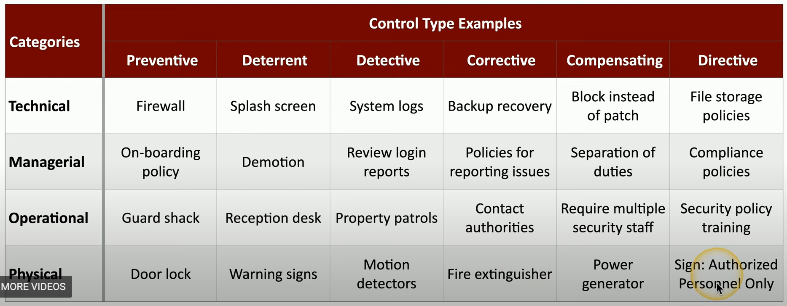

# Security Controls

Prevent security events, minimize impact, limit damage.

Category 1: Technical controls (use technology!)

- Firewalls
- Anti-virus

Category 2: Managerial controls (explain to people how to manage their stuff)

- security policies
- standard operating procedures

Category 3: Operational controls (use people!)

- security guards
- awareness programs

Category 4: Physica controls (limit physical access to stuff)

- fences
- locks
- badge readers

Control Types:

- Preventative: Block access to a resource (you shall not pass!)
- Deterrent: Discourage an intrusion attempt (make attacker think twice)
- Detective: Identify and log an intrusion attempt (may or may not prevent access)
- Corrective: Apply a control AFTER event has been detected (fire extinguisher)
- Compensating: Existing controls aren't sufficient, temporary fix (backup power generator)
- Directive: Direct someone to security compliance (do this pls thx)

