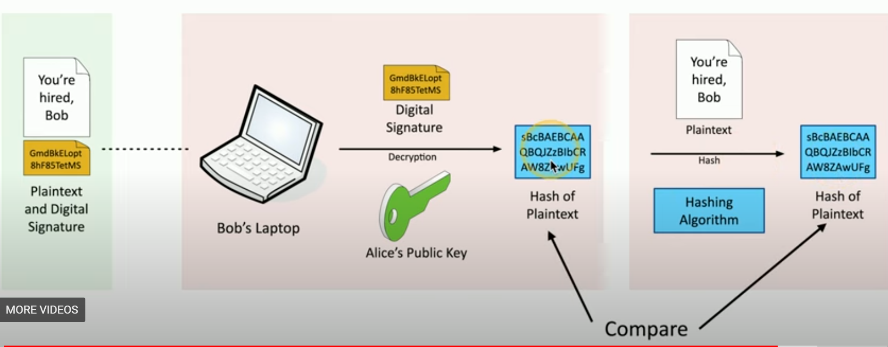

# The CIA Triad

aka AIC Triad, fundamentals of security, security objectives

Confidentiality, Integrity, Availability

Confidentiality: Encryption, Access Controls, TFA

Integrity: Hashing, Digital Signatures, Certificates, Non-repudiation (proof of integrity)

Availability: Redundancy, Fault Tolerance, Patching

# Non-repudiation

Proof of integrity: verify data that does not change -> use a hash

Non-repudiation: make sure signature isn't fake

Digital signatures

