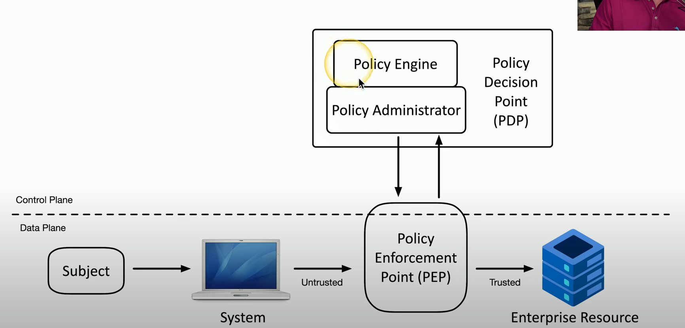

# The CIA Triad

aka AIC Triad, fundamentals of security, security objectives

Confidentiality, Integrity, Availability

Confidentiality: Encryption, Access Controls, TFA

Integrity: Hashing, Digital Signatures, Certificates, Non-repudiation (proof of integrity)

Availability: Redundancy, Fault Tolerance, Patching

# Non-repudiation

Proof of integrity: verify data that does not change -> use a hash

Non-repudiation: make sure signature isn't fake

Digital signatures

# Authentication, Authorization, and Accounting

Authorization: what access do you have?

Accounting: log everything

Certificate-based authentication

Authorization model: Users and services -> data and application

simple map: user -> resource. Problem: doesn't scale very well.

solution: roles, groups -> resource

# Gap Analysis

The Gap: where you are vs where you want to be

Baselines: 
- NIST Special Publication 800-171 Revision 2
- ISO/IEC 27001 Information security management systems

# Zero Trust

Zero trust environment: security check for each device, resource in the network. Everything must be verified.

Planes of operation: physica, virtual, cloud

Data plane vs control plane

Controlling trust:
- Adaptive identity: look at other things about the person to help identify them
- Threat scope reduction: decrease number of possible entry points
- Policy-driven access control

Security zones: where you come from, where you are going

Zero trust across planes:

# Physical Security

- Barricades: channel people through access point
- Access control vestibule
- Fencing
- Video Surveillance
- Security guard / access badges
- Lighting
- Sensors

# Deception and Disruption

Honeypots: attract bad guys / bots to test their attacks

Honeynets: netowork of honeypots. Much more believable environment

Honeyfiles: fake sensitive info

Honeytoken: bit of tracable token, fake email addresses