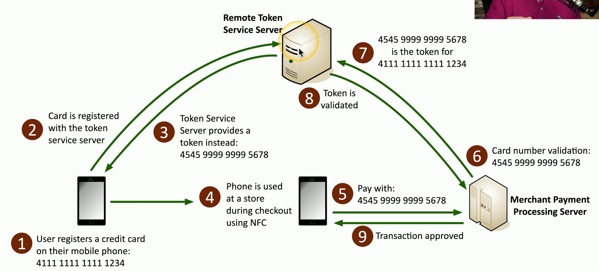

# Public Key Infrastructure

Managing Digital Certificates, binding certificates to people or devices

Symmetric encryption: single, shared key. Doesn't scale well.

Asymmetric encryption: private and public key.

Sender encrypts message with public key. Only receiver can decrypt the message with the private key.

# Encrypting Data

Drive encryption

Database encryption
- Transparent encryption: symmetric key
- Record-level encryption: symmetrically encrypt each column

DES Encryption Algorithm, AES Encryption Algorithm

Key stretching: make key stronger by performing multiple processes.

# Key Exchange

How do you share an encryption key? Out-of-band key exchange: do not use network.

In-band: asym enc the sym key. Ex: session keys

# Encryption Technologies

TPM on motherboard: Trusted Platform Module, provides cryptographic functions and has persistent memory

HSM: Hardware Security Module: used in large environments

Key management system: cloud-based key manager. Ex: dashlane

Secure Enclave

# Obfuscation

Defn: make something unclear, hiding info in plain sight. Ex: Steganography: security through obscurity

Image that contains data: cover text

Tokenization: sensitive info to a token. NOT encryption or hashing: aren't mathematically related. Remote token service server.

Data masking: hide part of the real data.

# Hashing and Digital Signatures

Like a fingerprint.

Diff input gives same output: collision. Prob will never happen.

Practical hashing: pw stoarge, verify file download

Salt: add some random things to a hash input.

Rainbow table: precomputed hash inputs. Salt stumps these.

Digital Signature: non-repudiation

# Blockchain

A distributed ledger. Everyone maintains a copy. 

# Certificates

Certificates provide trust. We trust certificate authority.

Web of trust

OCSP Stapling